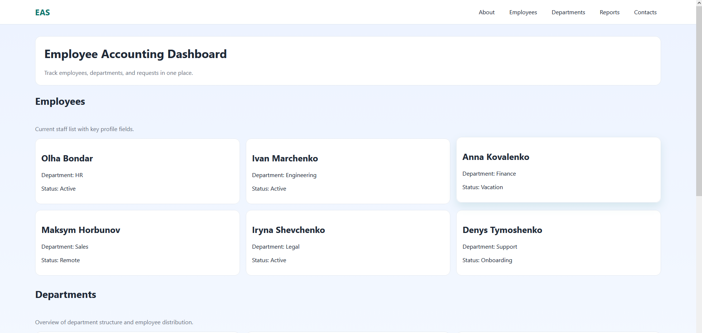
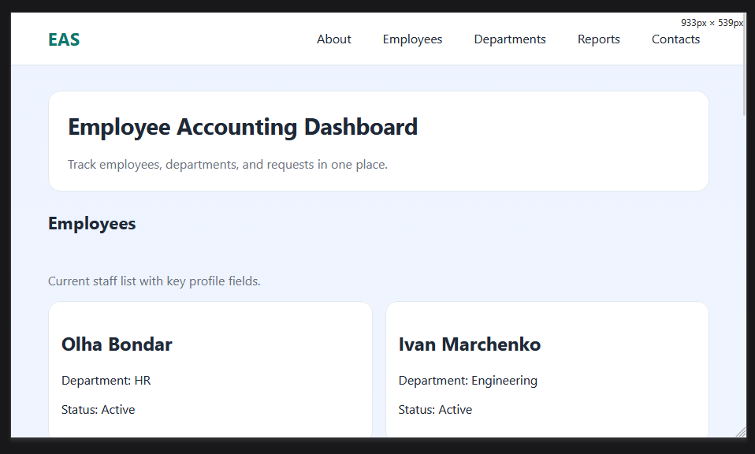
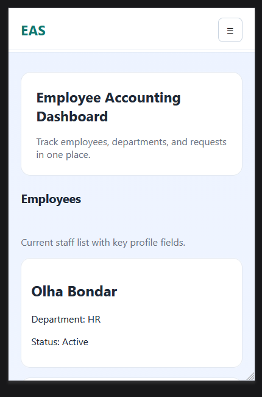
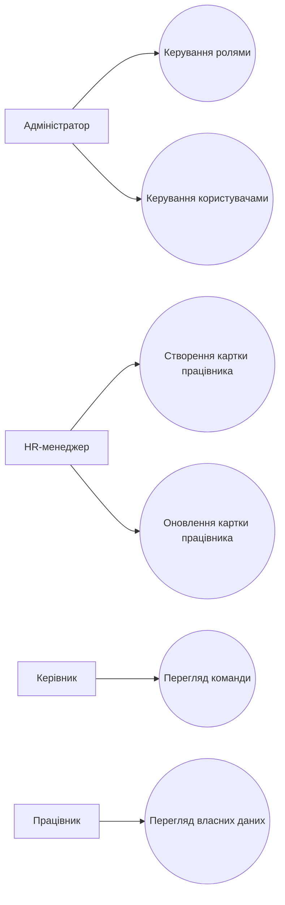
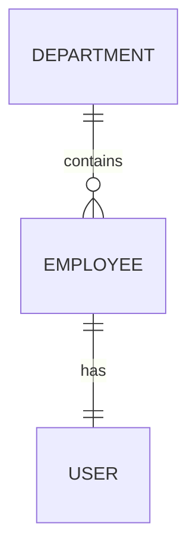

## Тема, мета, місце розташування сайту та звіту

**Тема:** «Веб-орієнтований застосунок системи обліку працівників підприємства.»

**Мета:** розробити зручний і адаптивний веб-застосунок для обліку працівників, який дозволяє переглядати та структурувати інформацію за відділами, відстежувати статуси співробітників, формувати базові звіти та демонструє реалізацію структурних компонентів інтерфейсу (header, main, footer).

### Посилання на виконані завдання

- Репозиторій власного веб-застосунку (GitHub): [посилання](https://github.com/kiril4a/lab1-employee-webapp)
- Власний веб-застосунок (Жива сторінка): [посилання](https://kiril4a.github.io/lab1-employee-webapp/html/index.html)
- Репозиторій звітного HTML-документа (GitHub): [посилання](https://github.com/kiril4a/IO-33_appRECORD-MatiushenkoKyrylo-FIOT-2026)
- Звітний HTML-документ (Жива сторінка): [посилання](https://kiril4a.github.io/IO-33_appRECORD-MatiushenkoKyrylo-FIOT-2026/lab/lab-1)

---

## Опис предметного середовища та бізнес-логіки

**Предметна галузь:** інформаційна система кадрового обліку. Застосунок надає інтерфейс для перегляду працівників, структури відділів, зведених показників та контактної інформації для комунікації між HR-відділом і керівниками.

### Структура веб-застосунку

- **Головна сторінка** - вітальний блок із коротким описом системи.
- **Employees** - перелік працівників у вигляді адаптивних карток.
- **Departments** - блок із відділами та їх поточними показниками.
- **Reports** - секція з ключовими метриками (кількість працівників, активні, у відпустці тощо).
- **Contacts** - контактні дані в нижньому колонтитулі.

### Сценарій взаємодії (бізнес-логіка)

1. Користувач відкриває сторінку та бачить навігацію і загальну інформацію.
2. Переходить до секції **Employees** і переглядає картки персоналу.
3. Переходить у **Departments** для аналізу структури відділів.
4. Відкриває **Reports** для швидкого перегляду агрегованих показників.
5. За потреби переходить у **Contacts** для зв'язку з HR.

### Функціональні вимоги

- Наявність логотипу та навігаційного меню в header.
- Перехід по пунктах меню до відповідних секцій сторінки.
- Відображення списку працівників у картках.
- Відображення блоку відділів із базовими показниками.
- Відображення секції звітів із ключовими метриками.
- Коректна робота бургер-меню на мобільних пристроях.

### Нефункціональні вимоги

- Адаптивна верстка для desktop, tablet, mobile.
- Плавна прокрутка до секцій та анімація появи елементів.
- Використання відносних одиниць (`rem`, `%`, `vw`, `vh`).
- Підтримка сучасних браузерів (Chrome, Firefox, Edge).
- Логічна та масштабована структура файлів проєкту.

### Стек технологій

- **HTML5** - семантична структура сторінки.
- **CSS3** - адаптивна верстка, grid, media queries, анімації.
- **JavaScript (Vanilla)** - динамічне формування карток, робота бургер-меню.
- **Git + GitHub** - контроль версій, гілки та коміти.

---

## Структура документа

Нижче наведено узагальнену структуру HTML для двох сторінок проєкту - **index.html** (Головна) та **about.html** (Про систему). Це спрощені DOM-скелети без стилів і скриптів, які демонструють розміщення основних блоків: `header`, `main`, `footer`.

### 1) Структура сторінки `index.html` (Головна)

```html
<!DOCTYPE html>
<html lang="uk">
<head>
	<meta charset="UTF-8" />
	<meta name="viewport" content="width=device-width, initial-scale=1.0" />
	<title>Employee Accounting System</title>
	<link rel="stylesheet" href="../css/style.css" />
</head>
<body>
	<header class="site-header">
		<div class="logo">EAS</div>
		<button id="menuBtn" class="menu-btn">☰</button>
		<nav id="mainNav" class="main-nav">
			<a href="about.html">About</a>
			<a href="#employees">Employees</a>
			<a href="#departments">Departments</a>
			<a href="#reports">Reports</a>
			<a href="#contacts">Contacts</a>
		</nav>
	</header>

	<main>
		<section class="hero">...</section>
		<section id="employees" class="cards-grid">...</section>
		<section id="departments" class="cards-grid">...</section>
		<section id="reports" class="reports-grid">...</section>
	</main>

	<footer id="contacts" class="site-footer">...</footer>

	<script src="../js/main.js"></script>
</body>
</html>
```

### 2) Структура сторінки `about.html` (Про систему)

```html
<!DOCTYPE html>
<html lang="uk">
<head>
	<meta charset="UTF-8" />
	<meta name="viewport" content="width=device-width, initial-scale=1.0" />
	<title>Про систему обліку працівників</title>
	<link rel="stylesheet" href="../css/style.css" />
</head>
<body>
	<header>
		<h1>Про систему</h1>
		<nav>
			<a href="index.html">Головна</a>
			<a href="#logic">Бізнес-логіка</a>
			<a href="#requirements">Вимоги</a>
		</nav>
	</header>

	<main>
		<section id="logic">...</section>
		<section id="requirements">...</section>
	</main>

	<footer>...</footer>
</body>
</html>
```

---

## Приклади реалізації елементів (код + результат)

### HTML-код секції працівників

```html
<section id="employees" class="cards-grid"></section>
```

### JavaScript-код динамічного рендерингу карток

```js
const employeesContainer = document.getElementById("employees");

const employees = [
	{ name: "Olha Bondar", department: "HR", status: "Active" },
	{ name: "Ivan Marchenko", department: "Engineering", status: "Active" },
	{ name: "Anna Kovalenko", department: "Finance", status: "Vacation" }
];

if (employeesContainer) {
	employeesContainer.innerHTML = employees
		.map(
			(employee) => `
			<article class="card">
				<h2>${employee.name}</h2>
				<p>Department: ${employee.department}</p>
				<p>Status: ${employee.status}</p>
			</article>`
		)
		.join("");
}
```

### CSS-код адаптивної сітки та бургер-меню

```css
.cards-grid {
	display: grid;
	grid-template-columns: repeat(3, minmax(0, 1fr));
	gap: 1rem;
}

@media (max-width: 992px) {
	.cards-grid {
		grid-template-columns: repeat(2, minmax(0, 1fr));
	}
}

@media (max-width: 520px) {
	.cards-grid {
		grid-template-columns: 1fr;
	}
}

.main-nav {
	max-height: 0;
	overflow: hidden;
	transition: max-height 0.3s ease;
}

.main-nav.open {
	max-height: 16rem;
}
```

Результат відображення:





---

## Моделювання системи

### Use-case діаграма (текстовий опис)

Актори: Адміністратор, HR-менеджер, Керівник, Працівник.

1. HR-менеджер додає/оновлює картки працівників.
2. Керівник переглядає команду та статуси.
3. Працівник переглядає власні дані.
4. Адміністратор керує правами доступу.



### ER-діаграма (текстовий опис)

Сутності:

- Employee(id, full_name, email, department_id, status)
- Department(id, name)
- User(id, login, role, employee_id)

Зв'язки:

- Department 1:N Employee
- Employee 1:1 User



---

## Організація файлової структури проєкту

```text
lab1-employee-webapp/
	html/
		index.html
		about.html
	css/
		style.css
	js/
		main.js
	assets/
	README.md
```

Така структура розділяє розмітку, стилі, логіку та документацію, що спрощує підтримку проєкту.

---

## Робота з Git і GitHub

### Структура гілок

- `main`
- `develop`
- `feature/lab1-core`

### Приклади логічно обгрунтованих комітів

- `chore: initialize lab1 employee webapp structure`
- `feat: add dynamic employee cards rendering`
- `feat: add working section navigation and responsive content blocks`
- `docs: add practical value and mermaid use-case er diagrams`

### Відкритий репозиторій

[https://github.com/kiril4a/lab1-employee-webapp](https://github.com/kiril4a/lab1-employee-webapp)

---

## Висновки

У ході виконання лабораторної роботи було сформовано опис предметної області, визначено мету, завдання, об'єкт і предмет дослідження, сформовано функціональні та нефункціональні вимоги, а також підготовлено Use-case і ER-моделі. Додатково реалізовано адаптивний інтерфейс із робочою навігацією, бургер-меню, сіткою контенту, медіа-запитами та візуальними ефектами. Отримані результати придатні для подальшого розширення системи та використання у наступних лабораторних роботах.
